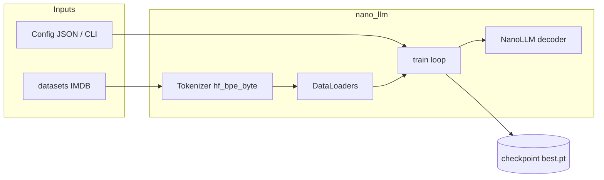
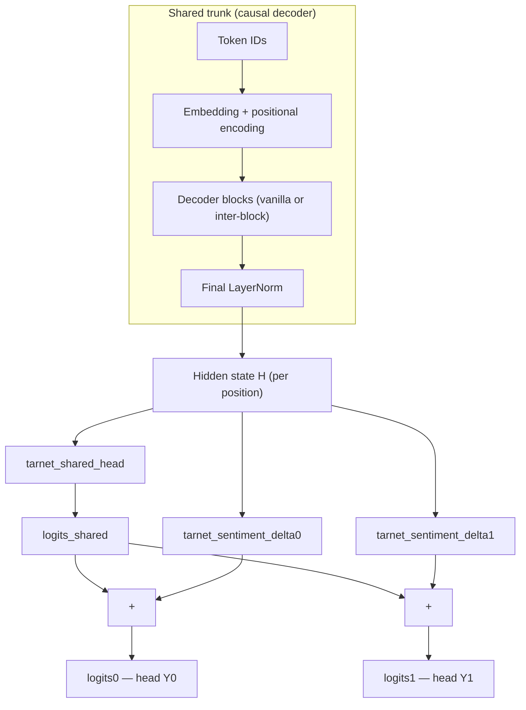

# Nano-LLM

**Small decoder-only transformers, trained from scratch on PyTorch.**

[CI](.github/workflows/ci.yml)
[Python 3.10+](https://www.python.org/downloads/)
[License: MIT](LICENSE)


---

## Contents


| Section                                   | What’s there                                            |
| ----------------------------------------- | ------------------------------------------------------- |
| [Features](#features)                     | Tokenizer, data, Docker, tooling                        |
| [Contributions](#contributions)           | Inter-block residual blocks, TARNet-style training      |
| [Architecture](#architecture)             | Data → train → checkpoint; optional TARNet head diagram |
| [Quick start](#quick-start)               | Docker, local install, W&B, generation                  |
| [How training works](#how-training-works) | Pipeline overview                                       |
| [Training IMDB](#training-imdb)           | `make train-imdb`, chat, resume                         |
| [Tests](#tests)                           | pytest, coverage, CI                                    |
| [Development](#development)               | `pip install -e ".[dev]"`, pre-commit                   |
| [Project structure](#project-structure)   | Layout of the repo                                      |
| [Config](#config)                         | Env vars and JSON config                                |
| [License](#license)                       | MIT                                                     |
| [Experiment archive](#experiment-archive) | Collapsed logs and notes                                |


---

## Features


|               |                                                                                                         |
| ------------- | ------------------------------------------------------------------------------------------------------- |
| **Tokenizer** | Hugging Face **byte-level BPE** (`hf_bpe_byte`); sinusoidal or **RoPE** positional encoding             |
| **Model**     | Causal multi-head self-attention; optional **inter-block** residuals; optional **TARNet** two-head mode |
| **Data**      | **IMDB** sentiment via Hugging Face `datasets` (tags or natural conditioning)                           |
| **Runtime**   | **Docker** (NGC PyTorch), **Make** targets, optional **Weights & Biases**                               |


---

## Contributions

This repo is a small **from-scratch** decoder LM; beyond the baseline stack, it highlights two implementation threads you can turn on via config / CLI:


|                                 |                                                                                                                                                                                                                                                                                                                                                                                                                                                                                                                                        |
| ------------------------------- | -------------------------------------------------------------------------------------------------------------------------------------------------------------------------------------------------------------------------------------------------------------------------------------------------------------------------------------------------------------------------------------------------------------------------------------------------------------------------------------------------------------------------------------- |
| **Inter-block residual blocks** | With `--block-attn-residuals`, layers use `[InterBlockAttnDecoderBlock](src/nano_llm/layers/block_attn_residual.py)` instead of the vanilla `[DecoderBlock](src/nano_llm/layers/decoder_block.py)`. Each step mixes the current stream with **prior macro-block outputs** through a **depth attention** residual (RMSNorm “keys,” one learned pseudo-query, softmax over depth) **before** the usual causal self-attention and FFN—parallel residual adds into the same hidden stream, with snapshots taken at macro-block boundaries. |
| **TARNet-like training**        | `--tarnet-two-heads`: one trunk, `logits_shared + Δ_k` readouts, factual **treatment** `T`, **weighted CE** on the active head, optional **JS** separation (`tarnet_head_separation_weight`). Diagram, equation, shared-head rationale, and inference (`--counterfactual`): [TARNet under Architecture](#architecture).                                                                                                                                                                                                                |


**Papers.** Macro-block depth mixing is in the same family as **Block AttnRes** in *[Attention Residuals](https://arxiv.org/abs/2603.15031)* (Kimi Team, 2026). Conceptual background and how it maps to this repo: [vanilla vs inter-block decoder](docs/vanilla_vs_inter_block_decoder.md). Dual-head training here is **inspired by** TARNet’s shared encoder and treatment-specific heads in *[Estimating individual treatment effect: generalization bounds and algorithms](https://arxiv.org/abs/1606.03976)* (Shalit, Johansson & Sontag)—adapted to next-token LM loss, not the paper’s causal ITE objective.

---

## Architecture

High-level data and training flow:




### TARNet two-head mode (`--tarnet-two-heads`)

`[NanoLLM](src/nano_llm/model.py)` keeps one causal trunk; on top of the final hidden state it stacks a **shared** vocab MLP (`logits_shared`) and two **sentiment** MLPs with `**logits_k = logits_shared + Δ_k(hidden)`**. The **last layer of each Δ** is **zero-init**, so both heads match the shared predictor at initialization. **Treatment** `T ∈ {0,1}` is the review’s factual sentiment (negative → 0, positive → 1); the trainer minimizes **weighted** next-token CE on `logits_T` plus optional **Jensen–Shannon** between the two heads (`tarnet_head_separation_weight`). Original TARNet (ITE, observational causal setup): see **[Contributions** § Papers](#contributions).




**Why `logits_shared` (vs two full heads)?** One projection carries **treatment-agnostic** structure (syntax, entities, review phrasing); **Δ₀**/**Δ₁** only **nudge** logits per sentiment—**less capacity** than duplicating two full readouts and a clearer Y0 vs Y1 **delta** on the same baseline (with the cold start behavior described above).

At inference, `scripts/chat.py --counterfactual` can sample from **Y0** or **Y1** (counterfactual-style continuations); `generate_both_heads` runs both branches from one trunk forward when contexts match.

---

## Quick start

### With Docker (recommended)

```bash
# Build and run training
make train
# or: docker compose up --build

# Continue training from checkpoint
make resume EPOCHS=15
# or: docker compose run train python scripts/train.py --resume checkpoints/best.pt --epochs 15

# Generate text
make generate PROMPT="<bos>[SENTIMENT] positive [/SENTIMENT] [REVIEW] " MAX_TOKENS=200

# Interactive shell
make shell
```

See `make help` for all targets.

### Weights & Biases (experiment tracking)

```bash
pip install wandb
wandb login   # paste API key from https://wandb.ai/authorize
```

Enable logging when training:

```bash
docker compose run --rm -e WANDB_API_KEY=... train python scripts/train.py \
  --use-wandb --wandb-project nano-llm-imdb \
  --wandb-tags imdb,hf_bpe_byte --epochs 10
```

Or with Make (set `WANDB_API_KEY` in your environment, or add it to `.env` for Compose):

```bash
make train-imdb ARGS='--use-wandb --wandb-project nano-llm --wandb-run-name run1'
```

Each epoch logs `train/loss`, `val/loss`, perplexity, learning rate. Use `--wandb-log-model` to upload `best.pt` at the end (larger upload).

### Local

```bash
pip install -r requirements.txt
pip install -e .

# Train with defaults
python scripts/train.py

# Override hyperparameters
python scripts/train.py --d-model 128 --epochs 5 --batch-size 32

# Optional BPE tokenizer
python scripts/train.py --tokenizer-type bpe --bpe-vocab-size 256

# Optional byte-level BPE tokenizer
python scripts/train.py --tokenizer-type bpe_byte --bpe-vocab-size 256

# Optional Hugging Face byte-level BPE tokenizer
python scripts/train.py --tokenizer-type hf_bpe_byte --bpe-vocab-size 256

# Continue training from checkpoint (more epochs)
python scripts/train.py --resume checkpoints/best.pt --epochs 15

# Early stopping (stop if val_loss unchanged for 10 epochs)
python scripts/train.py --epochs 3000 --early-stopping-patience 10
```

### Generation (inference)

After training, generate text from a checkpoint:

```bash
# Default: greedy, 100 tokens (set a checkpoint-appropriate prompt)
python scripts/generate.py

# Custom prompt and sampling (IMDB tags-style example)
python scripts/generate.py --prompt "<bos>[SENTIMENT] positive [/SENTIMENT] [REVIEW] " --max-tokens 200
python scripts/generate.py --method top_k --top-k 40 --temperature 0.8
python scripts/generate.py --method top_p --top-p 0.9 --seed 42

# Specific checkpoint
python scripts/generate.py --checkpoint checkpoints/best.pt
```

With Docker (after training in container, checkpoints in `./checkpoints`):

```bash
# Generate using GPU
docker compose run generate

# With options (args pass through to generate.py)
docker compose run generate --prompt "<bos>[SENTIMENT] positive [/SENTIMENT] [REVIEW] " --max-tokens 200 --method top_p
```

## How training works

1. **CLI and config** — `scripts/train.py` loads `DEFAULT_CONFIG` (and optional `--config` JSON), applies CLI overrides, then calls `nano_llm.train.train(cfg)`.
2. **Data** — Training loads **IMDB** from Hugging Face and formats each row into a conditioned string. The tokenizer is **trained on train+val text** unless you **resume** from a checkpoint with `tokenizer_state` / `vocab`, in which case it is restored to match the checkpoint. If present, JSON `dataset_id` must be `"imdb_sentiment"` (other values are rejected).
3. **Batches** — Chunking keeps the conditioning prefix (tags, natural instructions, or TARNet command + `[REVIEW]`) aligned with the review body; padded targets use ignore index `-100`.
4. **Model** — Causal decoder-only `NanoLLM`. With `--tarnet-two-heads`, `weight_tie` is off (see [Architecture → TARNet](#architecture)).
5. **Loss and optimization**
  - **Single head:** next-token cross-entropy (optional **weight-tied** embeddings).
  - **TARNet:** weighted CE on the head that matches factual `T`, optional JS via `tarnet_head_separation_weight` (full wiring in [Architecture → TARNet](#architecture)).
  - **Optimizer:** AdamW; **LR schedule:** cosine, linear, or none. **AMP:** `fp16` / `bf16` on CUDA when configured.
6. **Checkpointing** — When validation improves, `best.pt` stores `model` weights, full `config`, `vocab`, and `tokenizer_state` for reproducible load and chat.
7. **IMDB conditioning**
  - `**tags` (default):** `[SENTIMENT] positive|negative [/SENTIMENT] [REVIEW] … [/REVIEW]`.
  - `**natural`:** instruction text before `[REVIEW]` (`--imdb-conditioning-style natural`, optional `--imdb-positive-instruction` / `--imdb-negative-instruction`).
  - `**scripts/chat.py`** reads `imdb_conditioning_style` from the checkpoint for single-head models.

---

## Training IMDB

Train on IMDB, then interactive chat:

```bash
make train-imdb EPOCHS=30
make chat-imdb
```

`chat-imdb` follows the checkpoint’s `imdb_conditioning_style` (tags vs natural instructions) for single-head models; TARNet counterfactual mode uses the command prompt + `[REVIEW]`. Override checkpoint: `IMDB_CHECKPOINT=path/to/best.pt make chat-imdb`.

Generate (one shot):

```bash
docker compose run --rm generate \
  --checkpoint checkpoints/imdb_sentiment/hf_bpe_byte/best.pt \
  --prompt "<bos>[SENTIMENT] positive [/SENTIMENT] [REVIEW] " \
  --method top_p --temperature 0.7 --repetition-penalty 1.2 \
  --max-tokens 300 --stop-sequence "[/REVIEW]"
```

Resume IMDB training from a checkpoint:

```bash
docker compose run --rm train python scripts/train.py \
  --resume checkpoints/imdb_sentiment/hf_bpe_byte/best.pt \
  --tokenizer-type hf_bpe_byte --bpe-vocab-size 256 --position-encoding rope \
  --imdb-max-review-chars 500 --epochs 30 \
  --checkpoint-dir checkpoints/imdb_sentiment/hf_bpe_byte --early-stopping-patience 5
```

### IMDB Counterfactual Embedding Objective (legacy / disabled in current trainer)

The current `nano_llm.train.train` loop does **not** apply the embedding-mixture loss below; it only uses next-token CE (and TARNet terms if `--tarnet-two-heads`). The following described an older objective; CLI flags may still appear in configs for reference.

For sentiment-conditioned factual/counterfactual branch training (historical), enable:

- `--enable-counterfactual-objective`
- `--counterfactual-ce-weight` (default `1.0`)
- `--counterfactual-embedding-weight` (default `0.25`)

Loss:

`L_total = ce_weight * L_ce + emb_weight * ((1 - T) * L_neg + T * L_pos)`

- `T`: treatment from factual sentiment (`negative=0`, `positive=1`)
- `L_pos`, `L_neg`: cosine embedding losses between factual review embedding and the positive/negative branch embeddings

Example:

```bash
python scripts/train.py \
  --tokenizer-type hf_bpe_byte --bpe-vocab-size 256 \
  --enable-counterfactual-objective \
  --counterfactual-ce-weight 1.0 \
  --counterfactual-embedding-weight 0.25 \
  --epochs 10
```

---

## Tests

```bash
# Unit tests only (default; integration tests are deselected via pyproject.toml)
make test
# or: pytest

# With coverage (core package; fails under 40% when coverage is enabled)
make test-cov
# or: pytest --cov=src/nano_llm --cov-report=term-missing

# All tests including integration (slow; may download IMDB)
make test-all
# or: pytest --override-ini "addopts=-v -x"
```

[GitHub Actions](.github/workflows/ci.yml) runs Ruff (lint + format check) and the default pytest selection on pushes and pull requests to `main` / `master`.

---

## Development

```bash
pip install -e ".[dev]"
pre-commit install   # optional: ruff + whitespace/yaml hooks from .pre-commit-config.yaml
pre-commit run --all-files
```

Ruff in pre-commit is limited to `src/` and `tests/` (same scope as `make lint` / CI). Other hooks still run on staged files repo-wide.

---

## Project structure


| Path                       | Role                                                                   |
| -------------------------- | ---------------------------------------------------------------------- |
| `.github/workflows/ci.yml` | Ruff + pytest on push/PR to `main` / `master`                          |
| `.pre-commit-config.yaml`  | Optional Ruff + file hygiene hooks                                     |
| `.env.example`             | Template for secrets / env (copy to `.env`; never commit `.env`)       |
| `LICENSE`                  | MIT                                                                    |
| `docs/README.md`           | Index of Jupyter tutorials (tokenizer, IMDB, sampling, decoder stacks) |
| `src/nano_llm/`            | Model, layers, tokenizer, data, training, inference                    |
| `scripts/train.py`         | Training CLI                                                           |
| `scripts/generate.py`      | Generation CLI                                                         |


---

## Config


| Source                      | Purpose                                                          |
| --------------------------- | ---------------------------------------------------------------- |
| `scripts/train.py --config` | JSON file merged with defaults; highest priority after CLI flags |
| Env `NANO_LLM_CONFIG`       | Optional path to default JSON (used by `load_config` helpers)    |
| Env `WANDB_API_KEY`         | Optional; Weights & Biases when `--use-wandb`                    |


Copy `[.env.example](.env.example)` to `.env` for local or Compose secrets (never commit `.env`). CLI flags override values from config files.

---

## Framework

PyTorch in the **NGC PyTorch** Docker image. On CUDA, mixed precision (**fp16**) is the default when configured.

---

## License

Released under the [MIT License](LICENSE).

---

## Experiment archive

Unedited notes: Docker one-liners, training logs, and chat transcripts from past runs.

**Summary**

- **Large TARNet (≈20M params):** `d_model=512`, `num_heads=8`, `num_layers=6`, `d_ff=1888`, `seq_len=256`, RoPE, inter-block residuals, `hf_bpe_byte` vocab 256, `--tarnet-head-separation-weight 0.02`, 40 epochs, `counterfactual_repeat_20m`. **≈20,040,768** parameters; **≈4.8 h** wall time; val loss **≈1.96 → best ≈1.65**; perplexity **≈7 → ≈5.2** (val best ≈5.21).
- **Qualitative:** Counterfactual **Y0** vs **Y1** often skew negative vs positive; fluency is mixed at this scale.
- **512-wide comparison table:** vanilla vs inter-block vs TARNet — see expanded section below.

**Expand — raw logs, commands, and full table**

### IMDB ≈18–20M runs: training, validation, and sample quality (summary)

The logs below compare three **512-wide** IMDB runs (same `num_layers=6`, `d_ff=1888`, `seq_len=256`, RoPE, `hf_bpe_byte` vocab 256, batch 16). Rows are ordered **worst → best** by **best validation CE** (lower is better).


| Order     | Checkpoint                  | Decoder stack                        | LM head                                                | Epochs | Params     | Best val CE | Final val CE | Best val PPL | Wall time |
| --------- | --------------------------- | ------------------------------------ | ------------------------------------------------------ | ------ | ---------- | ----------- | ------------ | ------------ | --------- |
| 1 (worst) | `imdb_baseline_vanilla_20m` | Vanilla (`block_attn_residuals` off) | Single, `imdb_conditioning_style=natural`              | 20     | 18,062,400 | 1.727       | 1.727        | 5.62         | ≈1.2 h    |
| 2         | `imdb_baseline_natural_20m` | Inter-block                          | Single, natural                                        | 20     | 18,074,688 | 1.717       | 1.717        | 5.57         | ≈2.2 h    |
| 3 (best)  | `counterfactual_repeat_20m` | Inter-block                          | TARNet two heads, `tarnet_head_separation_weight=0.02` | 40     | 20,040,768 | 1.650       | 1.664        | 5.21         | ≈4.8 h    |


**What was added each step, and what improved**

1. **Baseline (worst): vanilla decoder + natural instructions, single head.** Lowest training cost here, but **best val CE ≈1.73**. Interactive **chat** samples (top_p 0.5, temp 0.7, repetition penalty 1.5) show **heavy garbling**: repeated junk tokens, odd symbols, and broken structure—usable as a negative example for this scale.
2. **Same recipe but inter-block decoder (`--block-attn-residuals`).** ≈12k extra parameters, about **2×** wall time for 20 epochs. **Best val CE improves by ≈0.01** (1.727 → 1.717). Samples under `[POSITIVE]` / `[NEGATIVE]` prompts are still flawed but read more like **English sentences** (opinion + plot-like phrases) with fewer random symbol runs.
3. **TARNet + longer training + head separation.** Adds **two sentiment heads**, **JS separation loss** (`0.02`), and **40 epochs** (about **2M** more parameters than the single-head models). **Best val CE ≈1.65** (about **0.07** better than the natural inter-block single-head run). **Evaluation:** `chat --counterfactual` prints **Y0** vs **Y1** from the same prompt; transcripts show **tone skew** (more negative/critical vs more positive openings) mixed with contradictions and truncation—interesting for counterfactual play, not production quality.

**Caveats:** TARNet and single-head losses are not identical objectives; more epochs and parameters are **confounded** with architecture changes.

---

### Test Results TARNet-style ≈20M-parameter run

```bash
docker compose run --rm train python scripts/train.py --epochs 40 --batch-size 16 --d-model 512 --num-heads 8 --num-layers 6 --d-ff 1888 --seq-len 256 --dropout 0.1 --tokenizer-type hf_bpe_byte --bpe-vocab-size 256 --tarnet-two-heads --tarnet-head-n-fc 2 --position-encoding rope --block-attn-residuals --macro-block-size 2 --max-block-representations 9 --checkpoint-dir checkpoints/counterfactual_repeat_20m --tarnet-head-separation-weight 0.02
```

```bash
docker compose run --rm -it chat --checkpoint checkpoints/counterfactual_repeat_20m/best.pt --max-tokens 340 --temperature 0.7 --method top_p --top-p 0.5 --counterfactual --repetition-penalty 1.5
```

Generate [+/-/b/q] (default b):
[Y0]
ember the same way, and it was all downhill from there. The pace is terrible, but nothing exciting happens. So what's with that? And why is this movie such a confused mess of old film? Too many story lines involve between those guards where you see it only to be fascistic (I'm not asking for more) to disgust over the center of this movie and think that you had good times past her and I was really let down but it seldom became more informative.

[Y1]
What a fun movie! The casting of the two leads is great. She portrays the dancer who has been married to her old but she would not have sex with her. And, in this case, sometimes it's about as good as everyone elses. This film was once again just before you'll stick with it and remind my opinion of that for you.

Generate [+/-/b/q] (default b):

[Y0]
For a film that has no character development, and it is pretty bad. The story is told in sometimes you'll find out what the heck was good about this movie. And just like when you throw monster moving on with the title of this movie and see something exceptional before that everyone did not give it another message. THIS IS SOMELY AWFUL!

[Y1]
raphics, so there is not a lot of contention in this movie. The story tells a good man who has been put together by describing the way he is in it and finally gets kidnapped but only to find out that his woman is now being tumbled. That's what I've seen for years! And he's excellent as the damaged counterfeiter; and Similarly she poses as an elderly man with a real job, you've seen it. The film moves with something more than just playing on.

[Y0]

ts, and then all of a sudden he decides to go back to live with his wife. There's nothing more than that, in fact it is just plain stupid and trite. And the ending was cheesy and overly similar for this movie. That's why I don't see how anybody mentioned that this film is goofball-made in its pornographical way. Sometimes you can't believe the reasons for examining what literally made this movie sometimes becomes out of nowhere; once you see SOYLENT NIGHT!

[Y1]

Perhaps the most interesting thing about this movie is that it has no sense of disbelief. The story is good, but not as funny as you can see, and it's excellent! That's what I liked.

[Y0]

OK, there are some funny moments in this movie. The characters were poorly drawn and extras were not too bad. And the story was terrible, I thought it was good for a low budget film. This is only because of it's just that it has non-plot tension and plot lines that severely cut together without an overall damning flatulence of any sort which is really abounding! Scarface was stilted, as in the old hospital cosmic mansion on his head with similar powers; he did NOT give kid all of what he examined that?? Affore comes to be mental into light-hearking but this film's finest storm is relevance, and yet you'll be modish and I've seen only for good old pick-basic election, when I th

[Y1]

One of the most incredible films ever made. This is a movie that worked beautifully, and it was considering the programmes on this site, but I found it to be a lot more open-minded than you have seen for example. The story is dark and nicely detailed with good suspension of disbelief and quality.

[Y0]
What a waste of time. To be honest, this is only the worst movie ever made! The premises in this movie seem to sound like it was dubbed or not. Sometimes you'll get by the casting of Cagney and Adams, which may be more than that.

[Y1]
Have you ever seen this movie? This is a superb film. The casting of the two leads, especially Sammo Hung as the woman whose father was born in Afghanistan and he did not get himself into being a parrot. I think that it's madly because it's strength and sentimentality is more out of place, as with most old movies they'll live without exceptional conversation.