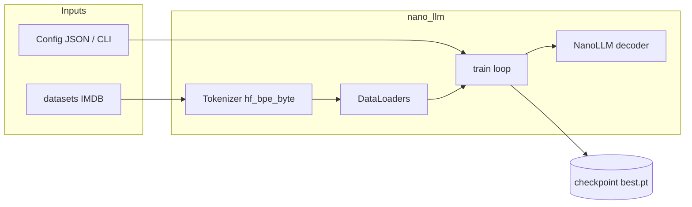

<div align="center">

# Nano-LLM

**Small decoder-only transformers, trained from scratch on PyTorch.**

[](.github/workflows/ci.yml)
[](https://www.python.org/downloads/)
[](LICENSE)

</div>

---

## Contents

| Section | What’s there |
|--------|----------------|
| [Features](#features) | Tokenizer, data, Docker, tooling |
| [Architecture](#architecture) | Data → train → checkpoint (diagram) |
| [Quick start](#quick-start) | Docker, local install, W&B, generation |
| [How training works](#how-training-works) | Pipeline overview |
| [Training IMDB](#training-imdb) | `make train-imdb`, chat, resume |
| [Tests](#tests) | pytest, coverage, CI |
| [Development](#development) | `pip install -e ".[dev]"`, pre-commit |
| [Project structure](#project-structure) | Layout of the repo |
| [Config](#config) | Env vars and JSON config |
| [License](#license) | MIT |
| [Experiment archive](#experiment-archive) | Collapsed logs and notes |

---

## Features

| | |
|:---|:---|
| **Tokenizer** | Hugging Face **byte-level BPE** (`hf_bpe_byte`); sinusoidal or **RoPE** positional encoding |
| **Model** | Causal multi-head self-attention; optional **inter-block** residuals; optional **TARNet** two-head mode |
| **Data** | **IMDB** sentiment via Hugging Face `datasets` (tags or natural conditioning) |
| **Runtime** | **Docker** (NGC PyTorch), **Make** targets, optional **Weights & Biases** |

---

## Architecture

High-level data and training flow:



---

## Quick start

### With Docker (recommended)

```bash
# Build and run training
make train
# or: docker compose up --build

# Continue training from checkpoint
make resume EPOCHS=15
# or: docker compose run train python scripts/train.py --resume checkpoints/best.pt --epochs 15

# Generate text
make generate PROMPT="<bos>[SENTIMENT] positive [/SENTIMENT] [REVIEW] " MAX_TOKENS=200

# Interactive shell
make shell
```

See `make help` for all targets.

### Weights & Biases (experiment tracking)

```bash
pip install wandb
wandb login   # paste API key from https://wandb.ai/authorize
```

Enable logging when training:

```bash
docker compose run --rm -e WANDB_API_KEY=... train python scripts/train.py \
  --use-wandb --wandb-project nano-llm-imdb \
  --wandb-tags imdb,hf_bpe_byte --epochs 10
```

Or with Make (set `WANDB_API_KEY` in your environment, or add it to `.env` for Compose):

```bash
make train-imdb ARGS='--use-wandb --wandb-project nano-llm --wandb-run-name run1'
```

Each epoch logs `train/loss`, `val/loss`, perplexity, learning rate. Use `--wandb-log-model` to upload `best.pt` at the end (larger upload).

### Local

```bash
pip install -r requirements.txt
pip install -e .

# Train with defaults
python scripts/train.py

# Override hyperparameters
python scripts/train.py --d-model 128 --epochs 5 --batch-size 32

# Optional BPE tokenizer
python scripts/train.py --tokenizer-type bpe --bpe-vocab-size 256

# Optional byte-level BPE tokenizer
python scripts/train.py --tokenizer-type bpe_byte --bpe-vocab-size 256

# Optional Hugging Face byte-level BPE tokenizer
python scripts/train.py --tokenizer-type hf_bpe_byte --bpe-vocab-size 256

# Continue training from checkpoint (more epochs)
python scripts/train.py --resume checkpoints/best.pt --epochs 15

# Early stopping (stop if val_loss unchanged for 10 epochs)
python scripts/train.py --epochs 3000 --early-stopping-patience 10
```

### Generation (inference)

After training, generate text from a checkpoint:

```bash
# Default: greedy, 100 tokens (set a checkpoint-appropriate prompt)
python scripts/generate.py

# Custom prompt and sampling (IMDB tags-style example)
python scripts/generate.py --prompt "<bos>[SENTIMENT] positive [/SENTIMENT] [REVIEW] " --max-tokens 200
python scripts/generate.py --method top_k --top-k 40 --temperature 0.8
python scripts/generate.py --method top_p --top-p 0.9 --seed 42

# Specific checkpoint
python scripts/generate.py --checkpoint checkpoints/best.pt
```

With Docker (after training in container, checkpoints in `./checkpoints`):

```bash
# Generate using GPU
docker compose run generate

# With options (args pass through to generate.py)
docker compose run generate --prompt "<bos>[SENTIMENT] positive [/SENTIMENT] [REVIEW] " --max-tokens 200 --method top_p
```

## How training works

1. **CLI and config** — `scripts/train.py` loads `DEFAULT_CONFIG` (and optional `--config` JSON), applies CLI overrides, then calls `nano_llm.train.train(cfg)`.

2. **Data** — Training loads **IMDB** from Hugging Face and formats each row into a conditioned string. The tokenizer is **trained on train+val text** unless you **resume** from a checkpoint with `tokenizer_state` / `vocab`, in which case it is restored to match the checkpoint. If present, JSON `dataset_id` must be `"imdb_sentiment"` (other values are rejected).

3. **Batches** — Chunking keeps the conditioning prefix (tags, natural instructions, or TARNet command + `[REVIEW]`) aligned with the review body; padded targets use ignore index `-100`.

4. **Model** — Causal decoder-only `NanoLLM`. With `--tarnet-two-heads`: shared vocab head plus two sentiment heads; `weight_tie` is off in that mode.

5. **Loss and optimization**
   - **Single head:** next-token cross-entropy (optional **weight-tied** embeddings).
   - **TARNet:** treatment-weighted CE across heads plus optional `tarnet_head_separation_weight` (Jensen–Shannon between head logits).
   - **Optimizer:** AdamW; **LR schedule:** cosine, linear, or none. **AMP:** `fp16` / `bf16` on CUDA when configured.

6. **Checkpointing** — When validation improves, `best.pt` stores `model` weights, full `config`, `vocab`, and `tokenizer_state` for reproducible load and chat.

7. **IMDB conditioning**
   - **`tags` (default):** `[SENTIMENT] positive|negative [/SENTIMENT] [REVIEW] … [/REVIEW]`.
   - **`natural`:** instruction text before `[REVIEW]` (`--imdb-conditioning-style natural`, optional `--imdb-positive-instruction` / `--imdb-negative-instruction`).
   - **`scripts/chat.py`** reads `imdb_conditioning_style` from the checkpoint for single-head models.

---

## Training IMDB

Train on IMDB, then interactive chat:

```bash
make train-imdb EPOCHS=30
make chat-imdb
```

`chat-imdb` follows the checkpoint’s `imdb_conditioning_style` (tags vs natural instructions) for single-head models; TARNet counterfactual mode uses the command prompt + `[REVIEW]`. Override checkpoint: `IMDB_CHECKPOINT=path/to/best.pt make chat-imdb`.

Generate (one shot):

```bash
docker compose run --rm generate \
  --checkpoint checkpoints/imdb_sentiment/hf_bpe_byte/best.pt \
  --prompt "<bos>[SENTIMENT] positive [/SENTIMENT] [REVIEW] " \
  --method top_p --temperature 0.7 --repetition-penalty 1.2 \
  --max-tokens 300 --stop-sequence "[/REVIEW]"
```

Resume IMDB training from a checkpoint:

```bash
docker compose run --rm train python scripts/train.py \
  --resume checkpoints/imdb_sentiment/hf_bpe_byte/best.pt \
  --tokenizer-type hf_bpe_byte --bpe-vocab-size 256 --position-encoding rope \
  --imdb-max-review-chars 500 --epochs 30 \
  --checkpoint-dir checkpoints/imdb_sentiment/hf_bpe_byte --early-stopping-patience 5
```

### IMDB Counterfactual Embedding Objective (legacy / disabled in current trainer)

The current `nano_llm.train.train` loop does **not** apply the embedding-mixture loss below; it only uses next-token CE (and TARNet terms if `--tarnet-two-heads`). The following described an older objective; CLI flags may still appear in configs for reference.

For sentiment-conditioned factual/counterfactual branch training (historical), enable:

- `--enable-counterfactual-objective`
- `--counterfactual-ce-weight` (default `1.0`)
- `--counterfactual-embedding-weight` (default `0.25`)

Loss:

`L_total = ce_weight * L_ce + emb_weight * ((1 - T) * L_neg + T * L_pos)`

- `T`: treatment from factual sentiment (`negative=0`, `positive=1`)
- `L_pos`, `L_neg`: cosine embedding losses between factual review embedding and the positive/negative branch embeddings

Example:

```bash
python scripts/train.py \
  --tokenizer-type hf_bpe_byte --bpe-vocab-size 256 \
  --enable-counterfactual-objective \
  --counterfactual-ce-weight 1.0 \
  --counterfactual-embedding-weight 0.25 \
  --epochs 10
```

---

## Tests

```bash
# Unit tests only (default; integration tests are deselected via pyproject.toml)
make test
# or: pytest

# With coverage (core package; fails under 40% when coverage is enabled)
make test-cov
# or: pytest --cov=src/nano_llm --cov-report=term-missing

# All tests including integration (slow; may download IMDB)
make test-all
# or: pytest --override-ini "addopts=-v -x"
```

[GitHub Actions](.github/workflows/ci.yml) runs Ruff (lint + format check) and the default pytest selection on pushes and pull requests to `main` / `master`.

---

## Development

```bash
pip install -e ".[dev]"
pre-commit install   # optional: ruff + whitespace/yaml hooks from .pre-commit-config.yaml
pre-commit run --all-files
```

Ruff in pre-commit is limited to `src/` and `tests/` (same scope as `make lint` / CI). Other hooks still run on staged files repo-wide.

---

## Project structure

| Path | Role |
|------|------|
| `.github/workflows/ci.yml` | Ruff + pytest on push/PR to `main` / `master` |
| `.pre-commit-config.yaml` | Optional Ruff + file hygiene hooks |
| `.env.example` | Template for secrets / env (copy to `.env`; never commit `.env`) |
| `LICENSE` | MIT |
| `docs/README.md` | Index of Jupyter tutorials (tokenizer, IMDB, sampling, decoder stacks) |
| `src/nano_llm/` | Model, layers, tokenizer, data, training, inference |
| `scripts/train.py` | Training CLI |
| `scripts/generate.py` | Generation CLI |

---

## Config

| Source | Purpose |
|--------|---------|
| `scripts/train.py --config` | JSON file merged with defaults; highest priority after CLI flags |
| Env `NANO_LLM_CONFIG` | Optional path to default JSON (used by `load_config` helpers) |
| Env `WANDB_API_KEY` | Optional; Weights & Biases when `--use-wandb` |

Copy [`.env.example`](.env.example) to `.env` for local or Compose secrets (never commit `.env`). CLI flags override values from config files.

---

## Framework

PyTorch in the **NGC PyTorch** Docker image. On CUDA, mixed precision (**fp16**) is the default when configured.

---

## License

Released under the [MIT License](LICENSE).

---

## Experiment archive

Unedited notes: Docker one-liners, training logs, and chat transcripts from past runs.

**Summary**

- **Large TARNet (≈20M params):** `d_model=512`, `num_heads=8`, `num_layers=6`, `d_ff=1888`, `seq_len=256`, RoPE, inter-block residuals, `hf_bpe_byte` vocab 256, `--tarnet-head-separation-weight 0.02`, 40 epochs, `counterfactual_repeat_20m`. **≈20,040,768** parameters; **≈4.8 h** wall time; val loss **≈1.96 → best ≈1.65**; perplexity **≈7 → ≈5.2** (val best ≈5.21).
- **Qualitative:** Counterfactual **Y0** vs **Y1** often skew negative vs positive; fluency is mixed at this scale.
- **512-wide comparison table:** vanilla vs inter-block vs TARNet — see expanded section below.

<details>
<summary><strong>Expand — raw logs, commands, and full table</strong></summary>

### Raw paste (full log and commands)

_Historical paste._ Long `docker compose` lines were merged where the original had accidental mid-flag wraps (e.g. after `--tokenizer-type`).

docker compose run --rm -it chat --checkpoint "checkpoints/imdb_sentiment/hf_bpe_byte/best.pt" --max-tokens 240 --temperature 0.9 --top-p 0.9 --repetition-penalty 1.15

docker compose run --rm train python scripts/train.py --epochs 20 --batch-size 16 --d-model 384 --num-heads 6 --num-layers 6 --d-ff 1536 --seq-len 256 --dropout 0.1 --tokenizer-type hf_bpe_byte --bpe-vocab-size 256 --tarnet-two-heads --tarnet-head-n-fc 2 --position-encoding sinusoidal --block-attn-residuals --macro-block-size 2 --max-block-representations 9 --checkpoint-dir checkpoints/counterfactual_new

docker compose run --rm -it chat --checkpoint checkpoints/counterfactual_new/best.pt --max-tokens 240 --temperature 0.8 --method top_p --top-p 0.85  --counterfactual  --repetition-penalty 1.05

### IMDB ≈18–20M runs: training, validation, and sample quality (summary)

The logs below compare three **512-wide** IMDB runs (same `num_layers=6`, `d_ff=1888`, `seq_len=256`, RoPE, `hf_bpe_byte` vocab 256, batch 16). Rows are ordered **worst → best** by **best validation CE** (lower is better).


| Order     | Checkpoint                  | Decoder stack                        | LM head                                                | Epochs | Params     | Best val CE | Final val CE | Best val PPL | Wall time |
| --------- | --------------------------- | ------------------------------------ | ------------------------------------------------------ | ------ | ---------- | ----------- | ------------ | ------------ | --------- |
| 1 (worst) | `imdb_baseline_vanilla_20m` | Vanilla (`block_attn_residuals` off) | Single, `imdb_conditioning_style=natural`              | 20     | 18,062,400 | 1.727       | 1.727        | 5.62         | ≈1.2 h    |
| 2         | `imdb_baseline_natural_20m` | Inter-block                          | Single, natural                                        | 20     | 18,074,688 | 1.717       | 1.717        | 5.57         | ≈2.2 h    |
| 3 (best)  | `counterfactual_repeat_20m` | Inter-block                          | TARNet two heads, `tarnet_head_separation_weight=0.02` | 40     | 20,040,768 | 1.650       | 1.664        | 5.21         | ≈4.8 h    |


**What was added each step, and what improved**

1. **Baseline (worst): vanilla decoder + natural instructions, single head.** Lowest training cost here, but **best val CE ≈1.73**. Interactive **chat** samples (top_p 0.5, temp 0.7, repetition penalty 1.5) show **heavy garbling**: repeated junk tokens, odd symbols, and broken structure—usable as a negative example for this scale.
2. **Same recipe but inter-block decoder (`--block-attn-residuals`).** ≈12k extra parameters, about **2×** wall time for 20 epochs. **Best val CE improves by ≈0.01** (1.727 → 1.717). Samples under `[POSITIVE]` / `[NEGATIVE]` prompts are still flawed but read more like **English sentences** (opinion + plot-like phrases) with fewer random symbol runs.
3. **TARNet + longer training + head separation.** Adds **two sentiment heads**, **JS separation loss** (`0.02`), and **40 epochs** (about **2M** more parameters than the single-head models). **Best val CE ≈1.65** (about **0.07** better than the natural inter-block single-head run). **Evaluation:** `chat --counterfactual` prints **Y0** vs **Y1** from the same prompt; transcripts show **tone skew** (more negative/critical vs more positive openings) mixed with contradictions and truncation—interesting for counterfactual play, not production quality.

**Caveats:** TARNet and single-head losses are not identical objectives; more epochs and parameters are **confounded** with architecture changes.

---

### Full training log — TARNet-style ≈20M-parameter run

docker compose run --rm train python scripts/train.py --epochs 40 --batch-size 16 --d-model 512 --num-heads 8 --num-layers 6 --d-ff 1888 --seq-len 256 --dropout 0.1 --tokenizer-type hf_bpe_byte --bpe-vocab-size 256 --tarnet-two-heads --tarnet-head-n-fc 2 --position-encoding rope --block-attn-residuals --macro-block-size 2 --max-block-representations 9 --checkpoint-dir checkpoints/counterfactual_repeat_20m --tarnet-head-separation-weight 0.02

INFO:nano_llm.train:Model config: d_model=512 num_heads=8 num_layers=6 d_ff=1888 seq_len=256 dropout=0.1
INFO:nano_llm.train:Model parameters: total=20,040,768 trainable=20,040,768
INFO:nano_llm.train:Epoch 1/40 train_loss=2.2577 val_loss=1.9603 val_ppl=7.10 val_bpb=1.599 train_ce=2.2579 val_ce=1.9605 lr=3.00e-04
INFO:nano_llm.train:Epoch 2/40 train_loss=1.9285 val_loss=1.8604 val_ppl=6.43 val_bpb=1.518 train_ce=1.9288 val_ce=1.8606 lr=2.98e-04
INFO:nano_llm.train:Epoch 3/40 train_loss=1.8450 val_loss=1.8089 val_ppl=6.10 val_bpb=1.476 train_ce=1.8453 val_ce=1.8092 lr=2.96e-04
INFO:nano_llm.train:Epoch 4/40 train_loss=1.7943 val_loss=1.7763 val_ppl=5.91 val_bpb=1.449 train_ce=1.7946 val_ce=1.7766 lr=2.93e-04
INFO:nano_llm.train:Epoch 5/40 train_loss=1.7571 val_loss=1.7520 val_ppl=5.77 val_bpb=1.429 train_ce=1.7574 val_ce=1.7522 lr=2.89e-04
INFO:nano_llm.train:Epoch 6/40 train_loss=1.7277 val_loss=1.7351 val_ppl=5.67 val_bpb=1.415 train_ce=1.7280 val_ce=1.7354 lr=2.84e-04
INFO:nano_llm.train:Epoch 7/40 train_loss=1.7035 val_loss=1.7203 val_ppl=5.59 val_bpb=1.403 train_ce=1.7038 val_ce=1.7206 lr=2.78e-04
INFO:nano_llm.train:Epoch 8/40 train_loss=1.6826 val_loss=1.7091 val_ppl=5.52 val_bpb=1.394 train_ce=1.6830 val_ce=1.7094 lr=2.71e-04
INFO:nano_llm.train:Epoch 9/40 train_loss=1.6641 val_loss=1.6993 val_ppl=5.47 val_bpb=1.386 train_ce=1.6645 val_ce=1.6996 lr=2.64e-04
INFO:nano_llm.train:Epoch 10/40 train_loss=1.6476 val_loss=1.6914 val_ppl=5.43 val_bpb=1.380 train_ce=1.6480 val_ce=1.6917 lr=2.56e-04
INFO:nano_llm.train:Epoch 11/40 train_loss=1.6321 val_loss=1.6831 val_ppl=5.38 val_bpb=1.373 train_ce=1.6325 val_ce=1.6834 lr=2.48e-04
INFO:nano_llm.train:Epoch 12/40 train_loss=1.6178 val_loss=1.6775 val_ppl=5.35 val_bpb=1.368 train_ce=1.6182 val_ce=1.6778 lr=2.38e-04
INFO:nano_llm.train:Epoch 13/40 train_loss=1.6047 val_loss=1.6716 val_ppl=5.32 val_bpb=1.364 train_ce=1.6051 val_ce=1.6719 lr=2.29e-04
INFO:nano_llm.train:Epoch 14/40 train_loss=1.5922 val_loss=1.6688 val_ppl=5.31 val_bpb=1.361 train_ce=1.5926 val_ce=1.6691 lr=2.18e-04
INFO:nano_llm.train:Epoch 15/40 train_loss=1.5802 val_loss=1.6659 val_ppl=5.29 val_bpb=1.359 train_ce=1.5806 val_ce=1.6662 lr=2.08e-04
INFO:nano_llm.train:Epoch 16/40 train_loss=1.5689 val_loss=1.6608 val_ppl=5.26 val_bpb=1.355 train_ce=1.5693 val_ce=1.6611 lr=1.97e-04
INFO:nano_llm.train:Epoch 17/40 train_loss=1.5576 val_loss=1.6581 val_ppl=5.25 val_bpb=1.353 train_ce=1.5581 val_ce=1.6585 lr=1.85e-04
INFO:nano_llm.train:Epoch 18/40 train_loss=1.5474 val_loss=1.6570 val_ppl=5.24 val_bpb=1.352 train_ce=1.5478 val_ce=1.6573 lr=1.74e-04
INFO:nano_llm.train:Epoch 19/40 train_loss=1.5370 val_loss=1.6530 val_ppl=5.22 val_bpb=1.348 train_ce=1.5374 val_ce=1.6533 lr=1.62e-04
INFO:nano_llm.train:Epoch 20/40 train_loss=1.5271 val_loss=1.6520 val_ppl=5.22 val_bpb=1.348 train_ce=1.5275 val_ce=1.6524 lr=1.50e-04
INFO:nano_llm.train:Epoch 21/40 train_loss=1.5173 val_loss=1.6543 val_ppl=5.23 val_bpb=1.349 train_ce=1.5177 val_ce=1.6546 lr=1.39e-04
INFO:nano_llm.train:Epoch 22/40 train_loss=1.5080 val_loss=1.6510 val_ppl=5.21 val_bpb=1.347 train_ce=1.5084 val_ce=1.6513 lr=1.27e-04
INFO:nano_llm.train:Epoch 23/40 train_loss=1.4987 val_loss=1.6519 val_ppl=5.22 val_bpb=1.347 train_ce=1.4992 val_ce=1.6523 lr=1.16e-04
INFO:nano_llm.train:Epoch 24/40 train_loss=1.4901 val_loss=1.6522 val_ppl=5.22 val_bpb=1.348 train_ce=1.4906 val_ce=1.6526 lr=1.04e-04
INFO:nano_llm.train:Epoch 25/40 train_loss=1.4815 val_loss=1.6503 val_ppl=5.21 val_bpb=1.346 train_ce=1.4820 val_ce=1.6507 lr=9.33e-05
INFO:nano_llm.train:Epoch 26/40 train_loss=1.4733 val_loss=1.6534 val_ppl=5.22 val_bpb=1.349 train_ce=1.4738 val_ce=1.6538 lr=8.26e-05
INFO:nano_llm.train:Epoch 27/40 train_loss=1.4654 val_loss=1.6523 val_ppl=5.22 val_bpb=1.348 train_ce=1.4659 val_ce=1.6527 lr=7.24e-05
INFO:nano_llm.train:Epoch 28/40 train_loss=1.4579 val_loss=1.6560 val_ppl=5.24 val_bpb=1.351 train_ce=1.4584 val_ce=1.6563 lr=6.26e-05
INFO:nano_llm.train:Epoch 29/40 train_loss=1.4509 val_loss=1.6541 val_ppl=5.23 val_bpb=1.349 train_ce=1.4514 val_ce=1.6545 lr=5.34e-05
INFO:nano_llm.train:Epoch 30/40 train_loss=1.4443 val_loss=1.6561 val_ppl=5.24 val_bpb=1.351 train_ce=1.4448 val_ce=1.6565 lr=4.48e-05
INFO:nano_llm.train:Epoch 31/40 train_loss=1.4385 val_loss=1.6554 val_ppl=5.24 val_bpb=1.350 train_ce=1.4390 val_ce=1.6558 lr=3.68e-05
INFO:nano_llm.train:Epoch 32/40 train_loss=1.4327 val_loss=1.6586 val_ppl=5.25 val_bpb=1.353 train_ce=1.4333 val_ce=1.6590 lr=2.96e-05
INFO:nano_llm.train:Epoch 33/40 train_loss=1.4278 val_loss=1.6594 val_ppl=5.26 val_bpb=1.354 train_ce=1.4284 val_ce=1.6598 lr=2.30e-05
INFO:nano_llm.train:Epoch 34/40 train_loss=1.4235 val_loss=1.6608 val_ppl=5.26 val_bpb=1.355 train_ce=1.4240 val_ce=1.6612 lr=1.73e-05
INFO:nano_llm.train:Epoch 35/40 train_loss=1.4198 val_loss=1.6631 val_ppl=5.28 val_bpb=1.357 train_ce=1.4203 val_ce=1.6636 lr=1.24e-05
INFO:nano_llm.train:Epoch 36/40 train_loss=1.4168 val_loss=1.6626 val_ppl=5.27 val_bpb=1.356 train_ce=1.4174 val_ce=1.6630 lr=8.32e-06
INFO:nano_llm.train:Epoch 37/40 train_loss=1.4141 val_loss=1.6635 val_ppl=5.28 val_bpb=1.357 train_ce=1.4146 val_ce=1.6639 lr=5.13e-06
INFO:nano_llm.train:Epoch 38/40 train_loss=1.4123 val_loss=1.6638 val_ppl=5.28 val_bpb=1.357 train_ce=1.4129 val_ce=1.6642 lr=2.84e-06
INFO:nano_llm.train:Epoch 39/40 train_loss=1.4110 val_loss=1.6640 val_ppl=5.28 val_bpb=1.357 train_ce=1.4116 val_ce=1.6644 lr=1.46e-06
INFO:nano_llm.train:Epoch 40/40 train_loss=1.4102 val_loss=1.6645 val_ppl=5.28 val_bpb=1.358 train_ce=1.4108 val_ce=1.6649 lr=1.00e-06


# Test Results

docker compose run --rm -it chat --checkpoint checkpoints/counterfactual_repeat_20m/best.pt --max-tokens 340 --temperature 0.7 --method top_p --top-p 0.5 --counterfactual --repetition-penalty 1.5

Generate [+/-/b/q] (default b):

[Y0]
One of the most amazing movies ever. This one is so bad that it's not fun to watch, and you can't help but laugh about it. There is no story in this movie, or excitement (sometimes) in this film which has been done with good performance and hardly scary moments. And I think the problem was that there was more to this movie than any of those which would really be damned about what was good for something that selled us to lower and move forward, or talking with. Sadly, the stories sequence of five minutes asides in confusion but because it's literally not gay or when you'll end just think agonize frievous only to you. The film's twist is dull; except for Shea and down-a-looking little tal

[Y1]
What a great movie! This is the best film ever made. The cast was fantasic, and sometimes it seemed like Jack Smith didn't try to be in this one as wonderfully as he did in his movies. As for the porn star, I though I think that's what you want to see.

Generate [+/-/b/q] (default b):

[Y0]
ember the same way, and it was all downhill from there. The pace is terrible, but nothing exciting happens. So what's with that? And why is this movie such a confused mess of old film? Too many story lines involve between those guards where you see it only to be fascistic (I'm not asking for more) to disgust over the center of this movie and think that you had good times past her and I was really let down but it seldom became more informative.

[Y1]
What a fun movie! The casting of the two leads is great. She portrays the dancer who has been married to her old but she would not have sex with her. And, in this case, sometimes it's about as good as everyone elses. This film was once again just before you'll stick with it and remind my opinion of that for you.

Generate [+/-/b/q] (default b):

[Y0]
For a film that has no character development, and it is pretty bad. The story is told in sometimes you'll find out what the heck was good about this movie. And just like when you throw monster moving on with the title of this movie and see something exceptional before that everyone did not give it another message. THIS IS SOMELY AWFUL!

[Y1]
raphics, so there is not a lot of contention in this movie. The story tells a good man who has been put together by describing the way he is in it and finally gets kidnapped but only to find out that his woman is now being tumbled. That's what I've seen for years! And he's excellent as the damaged counterfeiter; and Similarly she poses as an elderly man with a real job, you've seen it. The film moves with something more than just playing on.

</details>
