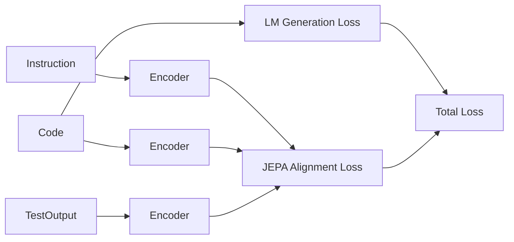

# Understanding LLM-JEPA

Reference document for integrating JEPA-style training into nano_llm. Exported from Cursor (3/22/2026). Paper: [arxiv.org/abs/2509.14252](https://arxiv.org/abs/2509.14252), Code: [github.com/galilai-group/llm-jepa](https://github.com/galilai-group/llm-jepa).

---

## Overview

**LLM-JEPA** (Huang, LeCun, Balestriero, 2025) brings **Joint Embedding Predictive Architectures (JEPA)** from vision into LLM training. JEPAs use embedding-space prediction instead of pixel/token reconstruction. The paper asks whether LLMs can benefit from this while keeping generative behavior.

---

## Core Idea: Two Views of the Same Knowledge

JEPA assumes multiple **views** of the same underlying content. In language, **(Text, Code)** pairs are used:

| View | Example |
|------|---------|
| **Text** | Natural language description of a regex, SQL query, or math problem |
| **Code** | The corresponding regex, SQL, or solution |

Examples: NL-RX (text↔regex), Spider (question↔SQL), GSM8K (problem↔answer).

---

## The LLM-JEPA Objective

$$\mathcal{L}_{\rm LLM-JEPA} = \underbrace{\sum_{\ell=2}^{L}\mathcal{L}_{\rm LLM}(\text{Text}_{1:\ell-1}, \text{Text}_{\ell})}_{\text{generative}} + \lambda \times \underbrace{d(\text{Pred}(\text{Enc}(\text{Text})), \text{Enc}(\text{Code}))}_{\text{JEPA}}$$

- **Enc**: LLM encoder (last-token hidden states)
- **Pred**: predictor (identity or small network)
- **d**: distance (L2, cosine, MSE, InfoNCE)

---

## Data Format (JSONL messages)

```json
{"messages": [
  {"role": "system", "content": "..."},
  {"role": "user", "content": "Natural language description"},
  {"role": "assistant", "content": "Code or answer"}
]}
```

---

## JEPA Loss Variants

- **Cosine (default)**: `1.0 - mean(cosine_similarity(user_emb, assistant_emb))`
- **L2**, **MSE**, **InfoNCE**

---

## Pretraining from Scratch

Use `--pretrain --plain --trainall` with `from_config()` (no pretrained weights). Datasets: paraphrase, Q&A, text–code pairs.

---

## Improvement Roadmap for nano_llm

### High-value novelty directions

1. **Execution-grounded JEPA (Code + Behavior views)**  
   - Views: `(instruction, code)` and `(code, unit-test trace/output)`  
   - Aligns code with runtime behavior, not just surface form.

2. **Multi-view JEPA**  
   - 4 views: spec, code, tests, execution trace (or AST)  
   - Cross-view JEPA graph.

3. **Hierarchical JEPA**  
   - Token-level + function-level + file-level objectives.

4. **Retriever-native coding**  
   - JEPA embeddings for query↔code↔fix retrieval (RAG).

5. **Counterfactual / hard-negative JEPA**  
   - Near-miss negatives (almost-correct code, wrong variable).

6. **Self-generated paired views**  
   - Auto-create: docstring↔code, bug↔patch, tests↔fix.

---

## 3-View Execution-Aligned JEPA (flagship idea)

- **Views**: `instruction`, `code`, `execution_result` (tests/output)
- **LM loss**: standard next-token prediction
- **JEPA losses**: instruction↔code, code↔execution_result
- **Result**: model learns "code that actually works," not just plausible syntax



---

## Causal Inference Extension

Combine JEPA with causal semantics:

- **Intervention-based views**: paraphrase, style changes (rename, format) — spurious changes, same intent
- **Invariance loss**: embeddings stable under `do(style)` interventions
- **Counterfactual loss**: broken code embeddings pushed away

**Combined objective**:
$$L = L_{LM} + \lambda_1 L_{instr\_code} + \lambda_2 L_{code\_exec} + \lambda_3 L_{inv} + \lambda_4 L_{cf}$$

---

## Datasets for (Text, Code) Pairs

| Dataset | Task |
|---------|------|
| CodeSearchNet | Code + docstring |
| HumanEval, MBPP | Problem + solution |
| Spider | Question + SQL |
| GSM8K | Math problem + answer |
| NL-RX (synth, turk) | NL + regex |

---

## Integration Notes for nano_llm

- nano_llm is a **decoder-only** transformer trained from scratch on Tiny Shakespeare (next-token only).
- To add JEPA: extend with paired-view data, add JEPA loss term to `train.py`, optionally add predictor tokens.
- For execution-grounded JEPA: need execution traces or test outputs as a third view.
- Data format would need to support `(input, target)` plus optional `(view2_embedding_target)` for alignment.
