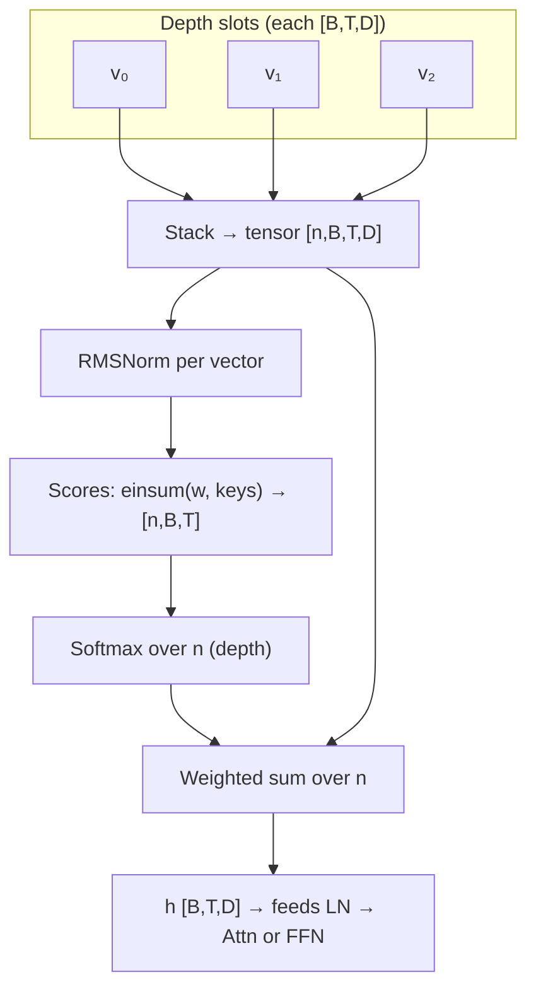
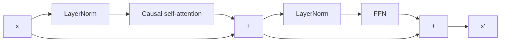
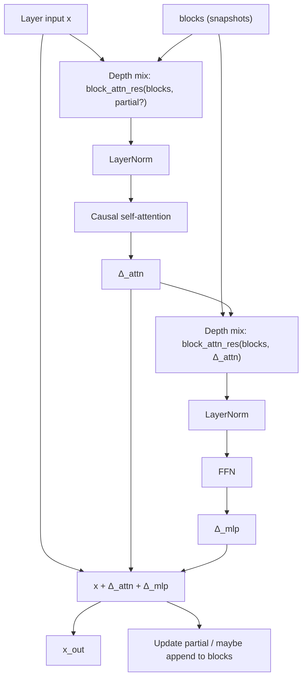

# Vanilla vs inter-block decoder stacks

**Runnable notebook:** [vanilla_vs_inter_block_decoder.ipynb](./vanilla_vs_inter_block_decoder.ipynb) — includes a **slow walkthrough** (`B=1, T=4, D=8`) with `print`ed depth weights, `blocks` / `partial` updates, and a sanity check against the library.

**Attention Residuals primer:** the section **Paper intuition: Attention Residuals and Block AttnRes** below restates the usual teaching narrative (residuals vs depth-wise softmax, scalar toy **5.3 vs 10**, block summaries **6.2**, backpack analogy) and **bridges** it to this repo’s **inter-block** implementation.

This doc is written so you can **read it once**, **teach it to someone else**, and **find the code** when you need details.

---

## Explain it in one minute

A transformer decoder is a stack of layers. Each layer updates a hidden sequence `x` (shape roughly: batch × positions × model width).

- **Vanilla** is the familiar pattern used in many GPT-style models: attention runs, its result is added to `x`, then the feed-forward network (FFN) runs on *that* updated `x`, and *that* result is added too. One main signal flows **up the stack**, step by step.

- **Inter-block** (this repo’s experimental stack) adds a **small memory** of earlier layer groups (“macro-blocks”). Before attention and before the FFN, the layer does **not** read plain `x` alone—it builds a **mixture** of a few saved tensors (earlier snapshots + a running summary inside the current group). The two sublayers also add their outputs back to the **same** starting `x` in parallel, which is different from vanilla wiring.

Same tokenizer, same heads, same training loop—only the **middle of the network** changes. Checkpoints from one mode **do not** load into the other without retraining.

---

## Paper intuition: Attention Residuals and Block AttnRes

This section is a **conceptual background** (teaching notes). It matches how “Attention Residuals” is often explained: *depth-wise* selection instead of only passing a single accumulated stream into each sublayer. **nano-llm** implements a **block-level** version of that idea (Part B); it does not implement the most expensive “attend every previous layer” variant end-to-end.

### 1) What a normal transformer block does

In a standard pre-norm decoder layer, the residual stream updates roughly as:

`x_{l+1} = x_l + F_l(x_l)`

So you **keep** the previous state `x_l` and **add** what the layer computes, `F_l(x_l)`. That skip path is the familiar **residual connection**. One way to motivate AttnRes is: the path always **adds** with coefficient 1; it does not **re-weight** earlier layer contributions *explicitly*—they are only mixed indirectly through the accumulated `x_l`. (In a tiny scalar toy below, we compare “use only the latest scalar state” vs “mix raw per-layer memories”; the goal is intuition, not a literal claim about every implementation detail.)

### 2) What problem the framing targets

Picture **one notebook** for many topics: every new section **appends** to the same page. Over depth:

- the representation gets **crowded**
- older useful structure can be **hard to isolate**
- magnitude can grow with depth

The AttnRes narrative is: with only fixed additive residuals, useful signals from specific depths can be **diluted** among everything that has been folded into `x_l`.

### 3) One-sentence idea

Instead of “always feed the next sublayer from the same fixed residual object,” allow:

**At each layer, look back at earlier layer outputs and choose which depths matter for this step.**

Hence **Attention Residuals**: attention over **depth** (which past hidden to trust), not over **token positions**.

### 4) What changes mathematically (sketch)

**Vanilla (single stream):**

`x_{l+1} = x_l + F_l(x_l)`

**AttnRes-style (mixture before `F`):** form a residual input by **weighting earlier layer outputs**:

`r_l = Σ_{i ≤ l} α_{l,i} x_i`

where `x_i` is the output of layer `i`, `α_{l,i}` are **learned, input-dependent** weights (e.g. softmax), and `r_l` is the **selected mixture** of past depths. The layer then applies `F_l` on top of that choice (exact wiring varies by paper; the *idea* is depth-wise selection).

### 5) Plain English

A later layer can ask:

- “Do I need **mostly** the last layer?”
- “Do I need something from **much** earlier?”
- “Should I **combine** a few depths and downweight the rest?”

So the network is not forced to treat every past contribution as equally “present” in the single scalar path; it can **retrieve** across depth.

### 6) Not the usual self-attention

- **Token self-attention:** position *t* looks at positions *t′* (along the sequence).
- **Attention Residuals:** layer *l* looks at **earlier layer indices** *i* (along **depth**).

Same softmax-and-weighted-sum *shape*, different **axis**.

### 7) Tiny toy — scalars only (4 layers, then “layer 5”)

Pretend each layer output is **one number** (not a vector). Previous layer outputs:

| Layer | Value |
|------|-------|
| 1 | 2 |
| 2 | 5 |
| 3 | 1 |
| 4 | 10 |

**Narrative contrast (toy “normal”):** suppose the next sublayer is presented with **only the latest** scalar **10**, then adds new computation: `x_5 = 10 + F(10)`. That story highlights **blind trust in the most recent number** and **no explicit knob** to upweight an older value like **5**.

**Attention Residuals (same toy):** assign depth weights, e.g.:

| Layer | α |
|------|---|
| 1 | 0.1 |
| 2 | 0.6 |
| 3 | 0.1 |
| 4 | 0.2 |

Mix:

`r = 0.1·2 + 0.6·5 + 0.1·1 + 0.2·10 = 0.2 + 3 + 0.1 + 2 = 5.3`

Then `x_5 = 5.3 + F(5.3)`. The model **emphasized layer 2 (value 5)** and did **not** let **10** dominate the residual input.

| Method | Residual input to the next `F` (toy) |
|--------|--------------------------------------|
| “Latest only” story | 10 |
| Attention Residual | 5.3 |

In real models, `x_i` are **vectors** and the α’s are **per-position** (and learned), but the **logic** is the same: *weighted mix of past depths* vs *one default path*.

### 8) Why this might help (claims in the literature)

Motivating work argues that depth-wise selection can improve:

- **controlled magnitudes** of hidden states
- **smoother gradients** across depth
- **better use** of very deep stacks
- **downstream metrics** in large-scale setups

Treat these as **hypotheses** until you measure them in *your* setup.

### 9) The catch: cost

If **every** layer attends over **all** previous layers, cost grows sharply:

- more **memory** (store or revisit many past activations)
- more **compute** and **communication** at scale

So the “full” AttnRes picture is expensive for very deep LMs.

### 10) Practical fix: Block Attention Residuals

**Block AttnRes** keeps the spirit but **compresses depth**:

1. **Group** consecutive layers into **blocks**.
2. **Summarize** each block into **one** representation (learned compression, not necessarily a dumb mean).
3. Run **attention over block summaries** instead of over every layer.

Analogy: do not read **every page** of a notebook—read **chapter summaries**, then pick which chapters matter.

| Method | What you attend over |
|--------|----------------------|
| Normal residual stream | implicit in single `x_l` |
| Full AttnRes | all previous layer outputs |
| **Block AttnRes** | **summaries of layer groups** |

### 11) Engineering at scale (names only)

Large systems may add **caching**, **pipeline communication**, or **two-phase** schedules so block-style depth attention stays fast. You only need those details when you train at cluster scale.

### 12) Three things to remember

1. Vanilla stacks **add** layer outputs along one residual path; they do not **explicitly** re-weight every past depth.
2. **Attention Residuals** let each step **choose** which earlier depths to mix into the input of `F_l`.
3. **Block** variants make that **affordable** by attending over **macro-block summaries**—the pattern **nano-llm** follows in Part B.

### 13) Backpack analogy

- **Standard residual path:** like stuffing everything into one bag and always opening it from the **top**.
- **AttnRes:** pause and ask **which older items** you actually need **right now**.
- **Block AttnRes:** keep **labeled pouches** (blocks) and choose among **pouches**, not every single item.

### How this connects to **nano-llm** (bridge)

- **Vanilla** here = Part A: ordinary `DecoderBlock`, one stream `x`, no depth mixing.
- **Inter-block** here = Part B: **`block_attn_res`** in `src/nano_llm/layers/block_attn_residual.py` — **softmax over a small set of tensors**: saved **macro-block snapshots** (`blocks`) and optionally an intra-block **`partial`** summary. That is **block-level** depth mixing (same *family* as Block AttnRes), **not** full attention over every prior layer.

If you read **Part B** next, you are reading the **concrete implementation** of that bridge.

---

## What stays the same (so you do not get lost)

Regardless of mode:

- Token embeddings and positional information (sinusoidal or RoPE) are unchanged.
- Each “layer” still contains **causal self-attention** and a **two-layer FFN** (ReLU MLP in this codebase).
- The LM head (weight-tied or separate) and optional TARNet heads sit **after** the stack.

What changes is only:

- Which **Python class** implements one layer (`DecoderBlock` vs `InterBlockAttnDecoderBlock`).
- How **`forward`** threads tensors between layers (`_run_vanilla_decoder_stack` vs `_run_inter_block_decoder_stack`).

| Mode | Config / CLI | Block class | Forward helper |
|------|----------------|-------------|----------------|
| Vanilla | `block_attn_residuals=False` (default); omit `--block-attn-residuals` | `DecoderBlock` | `_run_vanilla_decoder_stack` |
| Inter-block | `block_attn_residuals=True`; pass `--block-attn-residuals` | `InterBlockAttnDecoderBlock` | `_run_inter_block_decoder_stack` |

In code, `NanoLLM.decoder_stack` is the string `"vanilla"` or `"inter_block"` for quick inspection.

---

## Part A — Vanilla stack (standard, easy to explain)

### A.1 Idea in plain language

Imagine each layer as two edits to the representation:

1. “Let every position look at previous positions (attention) and propose an update.”
2. “Process each position with a small MLP (FFN) and propose another update.”

In the **pre-norm vanilla** block, you normalize, run the module, then **add** the output to the residual stream. Crucially, the FFN **sees the stream after the attention update**, not the raw input to the layer.

### A.2 Equations (match the code)

For one layer, with input `x`:

1. `x = x + Attn(LayerNorm(x))`
2. `x = x + FFN(LayerNorm(x))`

So the FFN’s `LayerNorm` is applied to **`x` after step 1**—that is the sequential residual stream everyone draws on whiteboards.

### A.3 Picture (one layer)

```text
        Layer input x
              │
    ┌─────────┴─────────┐
    │                   │
    ▼                   │
 LayerNorm              │
    │                   │
    ▼                   │
 Attention              │
    │                   │
    └──► (+) ◄──────────┘   add to x
              │
              │  (this sum is the input to the FFN branch)
              ▼
         LayerNorm
              │
              ▼
            FFN
              │
              └──► (+) ◄── same residual line (now post-attention)
                    │
                    ▼
              Layer output
```

### A.4 What you carry between layers

Only **`x`**: one tensor of shape `[batch, seq_len, d_model]`. No separate list of past activations.

### A.5 Why vanilla is the default baseline

- It matches what most papers and tutorials mean by “decoder block.”
- Easier to debug: one residual stream, no extra state.
- Good for comparing perplexity or behavior against public recipes.

**Code:** `src/nano_llm/layers/decoder_block.py`

---

## Part B — Inter-block stack (this project’s variant)

### B.1 Idea in plain language

Vanilla layers only see **the current** `x`. Inter-block layers also see a **short list of references** to how the network looked at **past milestones**:

- **`blocks`**: snapshots taken every **`macro_block_size`** layers (plus an initial snapshot right after embeddings/PE).
- **`partial`**: while you are **inside** a macro-block (between snapshots), a running summary of what the layers in that group have done so far. When a new macro-block starts, `partial` resets.

Before **attention** and again before the **FFN**, the layer replaces “use `x` directly” with “use a **weighted blend** of the tensors in `blocks`, and sometimes include `partial` in that blend.” The weights come from a tiny learned mechanism described below—not full multi-head attention over the sequence.

**High-level picture: what extra memory looks like**

Vanilla: one stream going up the stack.

```text
  x_emb → [L0] → [L1] → [L2] → [L3] → …
          ↑      ↑      ↑      ↑
       only current x enters each layer (aside from LN)
```

Inter-block: the same stream **plus** a shelf of snapshots the mixer can read.

```text
  blocks:  [ x_emb ]     [ x_emb, snap_01 ]     [ x_emb, snap_01, snap_23 ]  …
              │                   │                         │
              └───────┬───────────┴───────────┬─────────────┘
                      │                       │
  layer input x ──────┼──► depth-mix ──► Attn ──► …
                      └──► partial (inside macro-block only) can join the mix
```

### B.2 Macro-blocks with a concrete example (`macro_block_size = 2`)

Suppose you have **4** transformer layers (indices 0, 1, 2, 3) and `macro_block_size = 2`.

- **Start:** `blocks = [x_emb]` where `x_emb` is the hidden state **after** embedding (and sinusoidal PE if used). Think: “where the trunk starts.”
- **After layer 0:** You are **inside** the first macro-block (layers 0–1). The code **does not** append to `blocks` yet. It updates `partial` so the next layer knows what happened inside this pair.
- **After layer 1:** End of first macro-block. The layer output `x_out` is **appended** to `blocks`. `partial` clears for the next group.
- **Layers 2–3:** Same pattern: update `partial` mid-group, append to `blocks` after layer 3.

So for 4 layers and group size 2, you end up with **three** entries in `blocks` over time: initial `x_emb`, snapshot after layer 1, snapshot after layer 3. Deeper networks keep appending every `macro_block_size` layers.

**Timeline (vertical): layers flow downward; `blocks` grows on the right**

```text
  step          main residual x        blocks (snapshots)     partial
 ─────────────────────────────────────────────────────────────────────────
  init          (will enter L0)        [ x_emb ]              None

  after L0      x₁                     [ x_emb ]              P₀  (carry to L1)
  after L1      x₂                     [ x_emb , x₂ ]         None  ← new macro-block next

  after L2      x₃                     [ x_emb , x₂ ]         P₁  (carry to L3)
  after L3      x₄                     [ x_emb , x₂ , x₄ ]    None
```

**Macro-block grouping as brackets** (same 4 layers):

```text
  layer:     [ 0 | 1 ][ 2 | 3 ][ 4 | 5 ] …
             └macro─┘ └macro─┘
             snapshot at ↑     snapshot at ↑
             after L1          after L3
```

**When `partial` is included in the depth mix**

At the **first** layer of each macro-block (`layer_index % macro_block_size == 0`), mixing for the attention path uses **`blocks` only** (`partial_for_v = None`). Inside the macro-block, **`blocks + [partial]`** is stacked so the layer can attend to “snapshots + in-progress group summary.”

```text
  Layer 0 (start of macro):     mix from  [ B0 ]
  Layer 1 (inside macro):     mix from  [ B0 , partial ]
```

Here `B0` means the current list of completed snapshots (e.g. `[x_emb]` or `[x_emb, x₂]`, …).

### B.3 What `block_attn_res` does (depth mixing, not sequence attention)

This is **not** attention over token positions. It is a **softmax over a small number of depth slots** (each slot is a full `[batch, seq_len, d_model]` tensor).

**Setup:**

- You have `n` tensors stacked along a new axis: shape `[n, batch, seq_len, d_model]`.
- Optionally `n` is `len(blocks)` or `len(blocks) + 1` if `partial` is included.

**Steps (simplified):**

1. Apply **RMSNorm** per vector (per token position, per depth slice).
2. Compute a **scalar score** per depth slice using a **learned weight vector** `w` of length `d_model` (implemented as `Linear(d_model, 1, bias=False)`): for each depth index and each position, you get one logit.
3. **Softmax over depth** → weights `α_0, …, α_{n-1}` that sum to 1 **at each position**.
4. Output = weighted sum of the original tensors with those `α`’s.

So each position can say: “for my attention sublayer input, trust 70% the latest snapshot, 20% the one before, 10% the initial embedding”—but those percentages are **learned** and **input-dependent**, not hand-set.

There are **two** separate mixing operations per layer: one for the branch that feeds **self-attention** (`attn_res_proj`, `attn_res_norm`) and one for the branch that feeds the **FFN** (`mlp_res_proj`, `mlp_res_norm`). They can learn different depth weighting patterns.

**Code:** `block_attn_res` in `src/nano_llm/layers/block_attn_residual.py`.

**Tensor picture: one token position, depth axis**

Imagine fixing one batch row and one time index `t`. Each depth slot is a **vector** of length `d_model`:

```text
  depth
    0  ████  x_emb[t]     ──┐
    1  ████  snap_a[t]    ──┼──► RMSNorm + dot w ──► logits [ℓ0, ℓ1, ℓ2]
    2  ████  partial[t]    ──┘              │
                                            ▼
                                    softmax over depth
                                            │
                                            ▼
                                    α₀·v₀ + α₁·v₁ + α₂·v₂  =  h[t]  (vector in R^d_model)
```

**Same idea for all positions:** that softmax is done **per position**; the sequence length `T` is unchanged. Causal **self-attention** runs **after** this, over positions as usual.

**Mermaid: data flow inside `block_attn_res`**



**Two mixes per layer**

```text
  blocks (± partial) ──► block_attn_res (attn head) ──► LN ──► CausalSelfAttention ──► Δ_attn
         │
         └────────────► block_attn_res (mlp head)   ──► LN ──► FFN ──► Δ_mlp
                                                                 (uses Δ_attn in partial slot for 2nd mix)
```

### B.4 Parallel residuals (easy to miss when teaching)

Inside `InterBlockAttnDecoderBlock`:

- `delta_a` = output of attention (after LN) **without** adding to `x` first in the middle of the block.
- `delta_m` = output of FFN (after LN).
- **Layer output:** `x_out = x + delta_a + delta_m`

Both `delta_a` and `delta_m` connect back to the **same** layer input `x`. In vanilla, the FFN branch sits on top of `x + delta_a`. So the **information flow is not the same** even if the modules (Attention, FFN) look similar.

When you explain this orally, say: “Vanilla chains two residual updates; inter-block applies two updates from the same starting point, but each update is computed from a **depth-mixed** view of the representation.”

**Side-by-side residual wiring (one layer)**

Vanilla:

```text
        x
        │ ╲
        │  ╲  Δ_attn
        │   ╲
        └───●────  x + Δ_attn
                │ ╲
                │  ╲  Δ_mlp  (FFN sees normalized (x+Δ_attn))
                └───●────  x + Δ_attn + Δ_mlp
```

Inter-block:

```text
        x ────────────────┐
        │ ╲               │
        │  ╲ Δ_attn       │ same skip origin
        │   ╲             │
        └───┼─────────────┤
            │ ╲           │
            │  ╲ Δ_mlp     │
            └──┼──────────┘
               ▼
         x + Δ_attn + Δ_mlp
```

### B.5 Trimming `blocks` (`max_block_representations`)

If the network is deep, `blocks` could grow large. `trim_blocks` keeps:

- Always the **first** snapshot (the initial trunk input after embed/PE).
- The **most recent** completed snapshots, up to **`max_block_representations`** total list length.

So old macro-blocks fall out of memory, similar to a bounded history window.

**Code:** `trim_blocks` in `src/nano_llm/layers/block_attn_residual.py`; called from `NanoLLM._run_inter_block_decoder_stack` in `src/nano_llm/model.py`.

**Before / after (example `max_block_representations = 4`, list got too long)**

```text
  Before trim (length 6):
  ┌─────┬─────┬─────┬─────┬─────┬─────┐
  │ x_emb │ s1  │ s2  │ s3  │ s4  │ s5  │
  └─────┴─────┴─────┴─────┴─────┴─────┘
    keep first ─┘                     ↑ drop middle oldest

  After trim:
  ┌─────┬─────┬─────┬─────┐
  │ x_emb │ s3  │ s4  │ s5  │
  └─────┴─────┴─────┴─────┘
    head          └── most recent (tail)
```

### B.6 Extra parameters and cost

Per inter-block layer you add (among other things):

- Two `Linear(d_model, 1)` “depth scorers” and two `RMSNorm`s for the mixing paths.

Compute is still dominated by standard attention and FFN over `[batch, seq_len, d_model]`, but there is extra work to stack and mix the small `blocks` list each step.

### B.7 Checkpoints and training

The state dict includes different parameter names and shapes for inter-block vs vanilla blocks. **Use the same `block_attn_residuals` (and related) flags when loading** as when training. Mismatch will break loading or silently be wrong if you force it.

**Loader logic:** `src/nano_llm/inference/load.py` (reads `block_attn_residuals`, `macro_block_size`, `max_block_representations` from checkpoint config).

---

## Part C — Side-by-side summary (good for slides)

| Topic | Vanilla | Inter-block |
|--------|---------|-------------|
| Residual wiring | Sequential: FFN sees `x + Attn(…)` | Parallel: `x + Δ_attn + Δ_mlp` from same `x` |
| Memory across layers | None (only `x`) | `blocks` + `partial` |
| Sublayer inputs | From current `x` (via LN) | From **mixture** of `blocks` (± `partial`) |
| “Attention” over depth | No | Yes (`block_attn_res` softmax over depth) |
| Typical use here | Baseline, reproducibility | Experiment in this repo |
| Default in config | Yes (`block_attn_residuals=False`) | Opt-in |

---

## Part D — How to choose (practical)

- **Use vanilla** when you want the **standard** decoder, the clearest comparison to papers, or the simplest mental model.
- **Use inter-block** when you are explicitly running this repo’s **macro-block + depth-mixing** experiment. Tune `macro_block_size` (how often you snapshot) and `max_block_representations` (how much history mixing sees).

**CLI quick reference:**

- Vanilla: do **not** pass `--block-attn-residuals`.
- Inter-block: add `--block-attn-residuals`, optionally `--macro-block-size`, `--max-block-representations`.

**Config keys:** `block_attn_residuals`, `macro_block_size`, `max_block_representations` in `src/nano_llm/config.py`.

---

## Part E — Diagrams (Mermaid)

**Vanilla — one layer**



**Inter-block — one layer (conceptual)**



---

## Part F — Glossary

| Term | Meaning |
|------|---------|
| **Residual stream** | The main hidden sequence `x` that layers add to. |
| **Pre-norm** | Apply LayerNorm **before** Attention or FFN inside a sublayer. |
| **Macro-block** | A group of `macro_block_size` consecutive layers; a snapshot is stored at the end of each group. |
| **`blocks`** | List of saved tensors (snapshots) used by `block_attn_res`. |
| **`partial`** | Running summary within the current macro-block; fed into depth mixing until the group completes. |
| **Depth mixing** | Softmax-weighted sum over a few full-sequence tensors (`block_attn_res`), **not** over vocabulary or sequence positions. |

---

## Part G — Misconceptions (FAQ)

**“Inter-block is just a deeper vanilla model.”**  
No. Depth mixing and parallel residuals change the function class; stacking more vanilla layers is not equivalent.

**“Inter-block adds cross-layer attention over tokens.”**  
No. Causal self-attention is still over **positions** as usual. The extra mechanism mixes **a handful of depth-level tensors** per position.

**“I can load any checkpoint and toggle `--block-attn-residuals`.”**  
No. Build the same architecture the checkpoint was trained with.

**“Vanilla and inter-block differ only at inference.”**  
They differ in **architecture**; training and inference both use the chosen stack.

---

## Part H — Code map

| Topic | Location |
|--------|----------|
| Vanilla block | `src/nano_llm/layers/decoder_block.py` |
| Inter-block block, `block_attn_res`, `trim_blocks` | `src/nano_llm/layers/block_attn_residual.py` |
| Stack selection, `decoder_stack`, `_run_*` | `src/nano_llm/model.py` |
| Defaults | `src/nano_llm/config.py` |
| Train CLI | `scripts/train.py` |
| Load checkpoint | `src/nano_llm/inference/load.py` |

---

## Part I — Teaching checklist

If you are presenting this live:

1. Draw vanilla: one vertical line for `x`, two side branches for Attn and FFN, **second branch starts after first add**.
2. Say what “pre-norm” means in one sentence (normalize before the sublayer, add result to residual).
3. Draw inter-block: same Attn and FFN boxes, but inputs come from **blended snapshots**; both outputs land on **one** skip from the layer input.
4. Give **`macro_block_size = 2`** and walk **4 layers**—when snapshots appear.
5. Emphasize **checkpoint compatibility** last so people remember it.

The notebook lets listeners **run** tiny models and compare parameter counts: [vanilla_vs_inter_block_decoder.ipynb](./vanilla_vs_inter_block_decoder.ipynb).
